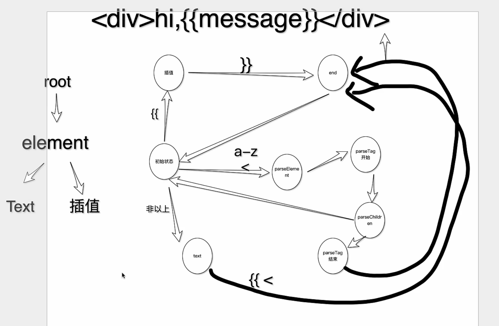

# compiler-core

## 有限状态机(finite state machine)

> 定义: 读取与一组让输入然后根据这些输入来更改为不同的状态

如图:



Vue3编译中的有限状态机同样也是根据[HTML规范](https://html.spec.whatwg.org/multipage/parsing.html)来实现的

### 利用有限状态机实现正则表达式

```ts
/abc/.test("abc");
```


